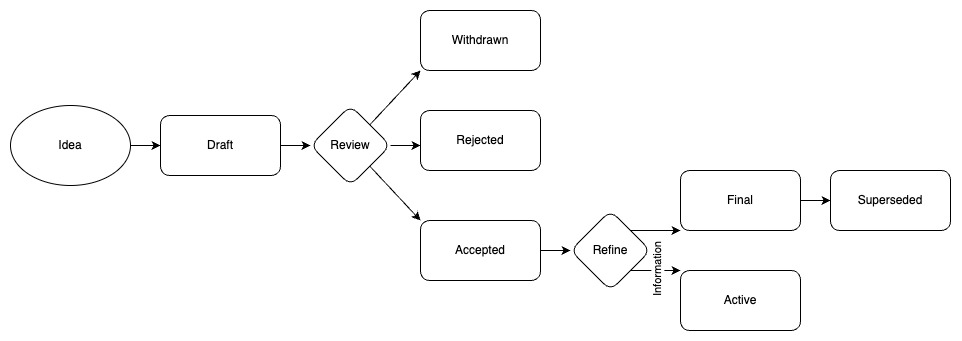

## What is a KAP?

KAP stands for Kabuto Action Proposal. A KAP is a formal document designed to propose, discuss, and coordinate actions within the Kabuto ecosystem, particularly focusing on projects related to Web3 technology and Hedera Hashgraph. The primary goal of a KAP is to establish a structured framework for transparent decision-making, community involvement, and governance across various Kabuto sub-projects.

A KAP should outline a proposed action, detailing its significance, technical specifications, and the reasoning behind its implementation within the Kabuto ecosystem.

KAPs serve as the primary method for suggesting significant actions, collecting feedback from the community, and documenting the decisions made within the Kabuto ecosystem. The responsibility of the KAP author is to encourage consensus among community members and to document any dissenting viewpoints.

As KAPs are stored as text documents in a versioned repository, their revision history serves as the historical record of the action proposal. This historical record is accessible through standard version control commands and can be viewed within the repository, ensuring transparency and accountability in the decision-making process.

## KAP Audience

The primary audience for KAPs includes core developers, business builders, and key decision-makers involved in the development and governance of Kabuto and its sub-projects.

In addition to this primary audience, the broader Kabuto community is encouraged to engage with KAPs. This includes users, enthusiasts, researchers, and individuals interested in Web3 technology and decentralized systems. Their valuable feedback and insights contribute significantly to the decision-making process.

Furthermore, KAPs may be leveraged by collaborating projects or ecosystems involved in Web3 technology, especially in proposals requiring collaboration across multiple projects. KAPs may serve as a resource for documenting API standards and specifications relevant to Kabuto's sub-projects.

The community-oriented nature of KAPs encourage collaboration, ensuring that stakeholders can contribute their perspectives and expertise. This aids in well-informed decision-making essential for the growth and governance of the Kabuto ecosystem.

## KAP Types

There are three primary types of KAPs within the Kabuto ecosystem:

* **Standard**: A Standard KAP outlines a new feature, improvement, or implementation for the Kabuto ecosystem. It could propose the development of a new functionality within a Kabuto sub-project or the enhancement of an existing feature. This type of KAP may also establish interoperability standards meant to be supported across various Kabuto-related projects. Once established, these standards might be adopted outside the core ecosystem before being potentially integrated into the Kabuto standard library or core functionalities in subsequent KAPs.

* **Information**: An Information KAP focuses on describing a design issue, providing general guidelines, or disseminating informational content to the Kabuto community. This type of KAP doesn’t directly propose new features but serves to impart knowledge or recommendations without necessarily reflecting a consensus or binding recommendation for the community. Users and contributors have the freedom to either follow or disregard the suggestions outlined in an Information KAP.

* **Action**: An Action KAP serves to propose and coordinate specific actions within the Kabuto ecosystem. It outlines concrete steps, initiatives, or decisions that necessitate community involvement and may require consensus for execution. Action KAPs might cover proposals for bug bounties, awareness campaigns, or the launch of new Kabuto Name Service (KNS) top-level domains (TLDs). These proposals aim to engage the community and require a formalized voting process for approval.

## KAP Workflow

### Starting with an idea

1. **Formulating the Idea**: The KAP process commences with the formulation of a specific proposal or idea for an action within the Kabuto ecosystem. It's recommended that each KAP focuses on a single key proposal or new concept. The more concentrated and clearly defined the proposal, the more successful the KAP tends to be. Not all enhancements or bug fixes require a KAP; some can be directly submitted to the relevant issue tracker for consideration.

2. **Identifying a Champion**: Every KAP must have a champion—a proponent who takes the responsibility of drafting the proposal, facilitating discussions within the appropriate forums, and striving to build consensus within the community. The champion (also known as the Author) should initially assess whether the idea is suitable for a KAP. Posting the idea to the relevant discussion category or venue within the community, such as the [KAP Discussions](https://github.com/kabuto-sh/proposals/discussions/categories/ideas) or [HBAR Foundry Zulip Chat](https://zulip.kabuto.sh/), is a recommended approach to vetting the idea. This helps save time by ensuring the idea is original and has potential for acceptance within the broader community.

3. **Vetting the Idea Publicly**: The Champion's role includes vetting the idea publicly before developing a full-fledged KAP. This step aims to prevent investing considerable effort in a proposal that might be rejected based on prior discussions or might be applicable only to the proposer. Seeking community feedback ensures the idea's relevance and applicability across various areas where Kabuto technologies are utilized.

4. **Drafting the KAP**: Once the Champion has received initial community feedback indicating the idea's viability for a KAP, they proceed to draft the KAP proposal. This draft is presented in the appropriate venue or platform, ensuring that it adheres to the prescribed KAP format, is of high quality, properly formatted, and adequately addresses initial concerns or considerations raised during the vetting phase.

Starting with a well-vetted and refined idea and proceeding to craft a comprehensive KAP ensures that the proposal is clear, relevant, and aligns with the community's consensus and needs within the Kabuto ecosystem.

### Submitting a KAP

1. **Identification of Co-Authors and Editors**: Though not required, every KAP should have multiple authors or an author and multiple editors. This represents a seed of community involvement in the KAP. These participants can be cultivated from the discussions about the idea around which the KAP is written.

2. **Role of a Sponsor**: The ideal scenario involves identifying a sponsor. A sponsor is a party who would benefit from the KAP. This sponsor provides both evidence of the KAP's usefulness and a path for execution. The name of the sponsor should be recorded in the KAP header field `Sponsors`. An example of this ideal would be a wallet development company sponsoring a KAP that defines a standard related to cryptographic key management.

3. **Submission of the Draft KAP**: Upon the readiness of the KAP, as determined by the sponsor or co-authors & editors, the KAP should be submitted as a draft as a pull request to the [KAP Github repository](https://github.com/kabuto-sh/proposals).

### Standard KAP Submission Workflow

The standard workflow for submitting a KAP includes the following steps:

- Fork the KAP repository and create a file named kap-NNNN.md, adhering to the prescribed KAP format, with NNNN being the next available KAP number not currently in use.

- Fill in the appropriate fields in the KAP header, such as "KAP:", "Type:", and "Status:", ensuring the KAP number in the "KAP:" field matches the file name, the type is "Standard", "Information", or "Action" as appropriate, and the status is "Draft".

- Push the draft KAP to a personal repository and submit a pull request.

**Review Process**: The KAP editors review the submitted pull request, evaluating the structure, formatting, and technical accuracy. Approval criteria include the completeness and technical soundness of the proposal, its descriptive title, and adherence to formatting guidelines. The initial review might be lenient, anticipating further corrections during the review process.

**Revision and Final Approval**: If the KAP requires revisions, an editor will provide specific instructions for the author to address. Once approved, the KAP is assigned a final number, and, after completion of the review process, the pull request will be merged into the main repository.

### KAP Maintenance

- **Life Cycle Phases**: Once a KAP reaches the Accepted, Final, Rejected, or Superseded state, it typically undergoes limited modifications. At this stage, KAPs are considered historical documents, no longer actively evolving specifications. The formal documentation of the expected behavior, especially for core features or standard library modules, is maintained in appropriate repositories or references outside the KAP system.

- **Maintenance of Standards Track KAPs**: For Standards Track KAPs in the Accepted state, changes based on implementation experience and user feedback may occur. Any alterations reflecting the implementation must be documented within the KAP, ensuring that the final state accurately describes the implemented solution.

- **Updates for Active (Informational) KAPs**: Active Informational and Process KAPs are subject to periodic updates to accommodate changes in development practices or other relevant details. The process for updating these KAPs depends on the specific nature and purpose of the individual proposal.

- **Reviving Deferred or Withdrawn KAPs**: Occasionally, a Withdrawn KAP might be revisited and updated substantially. However, in many cases, it might be more prudent to propose a new KAP rather than reviving an older one, especially if the proposed changes significantly differ from the original proposal.



## What belongs in a successful KAP?

Each KAP should have the following parts:

1. **Preamble**: [RFC 2822](https://datatracker.ietf.org/doc/html/rfc2822.html) style headers containing metadata about the KAP, including the KAP number, a concise title (limited to a maximum of 44 characters), names of authors, and optionally contact information for each author.
2. **Abstract**: a short (~200 word) description of the KAP.
3. **Motivation**: Crucial for KAPs intending to modify the Kabuto ecosystem or introduce changes to the technology. The motivation should clearly articulate why the current ecosystem specifications are inadequate to solve the problem addressed by the KAP. This section may include documented support from significant projects within the Kabuto ecosystem. KAPs lacking sufficient motivation may face rejection.
4. **Rationale**: Expands on the specification by explaining the reasoning behind specific design choices. It should cover alternative designs considered, related work (e.g., how the feature is supported in other technologies), and demonstrate consensus within the community. This segment should discuss important objections or concerns raised during discussions.
5. **Specification**: The technical details describing the syntax and semantics of any new feature introduced by the KAP. This section should provide comprehensive details to enable the development of interoperable implementations for major Kabuto platforms.
6. **Backwards Compatibility**: KAPs introducing backward incompatibilities should address these and explain their severity. The proposal should also outline strategies to manage these incompatibilities. KAPs lacking a comprehensive backward compatibility strategy may face outright rejection.
7. **Security Implications**: If there are security concerns related to the KAP, these should be explicitly detailed to ensure reviewers are aware of them.
8. **How to Teach This**: For KAPs introducing new functionality or modifying language behavior, including a section on guiding users on the application of the KAP. This may involve key points and suggested documentation changes to facilitate user adoption or code migration.
9. **Reference Implementation**: While the reference implementation must be completed before a KAP achieves “Final” status, it doesn't need to be finished before the proposal is accepted. The final implementation should encompass test code and appropriate documentation either for the Kabuto ecosystem reference or the standard library reference.
10. **Rejected Ideas**: Records ideas proposed during the KAP discussion that were ultimately rejected, along with the reasons for their rejection. This helps document the decision-making process and prevents re-proposing previously rejected ideas.
11. **Open Issues**: A section to list ideas that surface during the draft stage, warranting further discussion. This segment ensures all issues necessary for the KAP's readiness are addressed, reducing repeated discussions.
12. **Footnotes**: Contains cited footnotes within the KAP and serves as a repository for non-inline hyperlink targets.
13. **Copyright/License**: Each new KAP must be released under the [Apache License Version 2.0 - https://www.apache.org/licenses/LICENSE-2.0.txt](https://www.apache.org/licenses/LICENSE-2.0.txt). This step ensures the open nature of the KAP and adherence to specified licensing agreements.

## KAP Header Preamble

Each KAP must begin with an [RFC 2822](https://datatracker.ietf.org/doc/html/rfc2822.html) style header preamble. The headers much appear in the following order. Headers marked with "*" are optional. All other headers are required.

```
  KAP: <kap number>
  Title: <kap title>
  Author: <list of authors' real names and, optionally, email addresses or github handles>
* Editors: <list of editors' real names and, optionally, email addresses or github handles>
* Sponsors: <list of sponsors' real names and optionally, email addresses, github handles, or website>
  Discussions-To: <URL of current canonical discussion thread>
  Status: <Draft | Active | Accepted | Rejected | Withdrawn | Final | Superseded>
  Type: <Standard | Information | Action>
* Sub-project: <name of kabuto sub-project>
* Requires: <kap numbers>
  Created: <date created in yyyy-mm-dd format>
* Updated: <date updated in yyyy-mm-dd format>
* Replaces: <kap number>
* Superseded-By: <kap number>
```

## Auxiliary Files

KAPs may include auxiliary files such as diagrams. Such files should be named `kap-XXXX-Y.ext`, where the "XXXX" is the KAP number, "Y" is a serial number (starting at 1), and "ext" is replaced by the actual file extension.

All files should be placed in a subdirectory called `kap-XXXX` where "XXXX" is the KAP number.

## Transferring KAP Ownership

At times, there might arise a need to transfer ownership of a KAP to a new champion. Generally, it is advisable to maintain the original author as a co-author of the transferred KAP, though this decision ultimately lies with the original author. Transferring ownership is often necessary when the original author lacks the time or interest to update or proceed with the KAP process, or is inaccessible and unresponsive.

However, it's not recommended to transfer ownership simply because the original author disagrees with the proposed direction of the KAP. While the aim of the KAP process is to build consensus around a proposal, if consensus isn’t achievable, an author has the option to submit a competing KAP rather than transferring ownership for that reason. The primary objective is to maintain an open and collaborative environment while preserving the integrity and intent of the KAP process.

## Copyright
This document is licensed under the Apache License, Version 2.0 -- see (https://www.apache.org/licenses/LICENSE-2.0)
